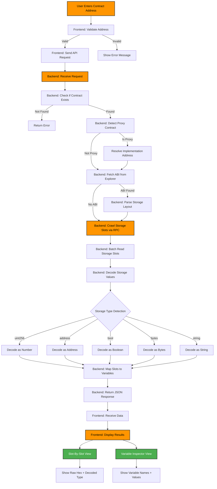
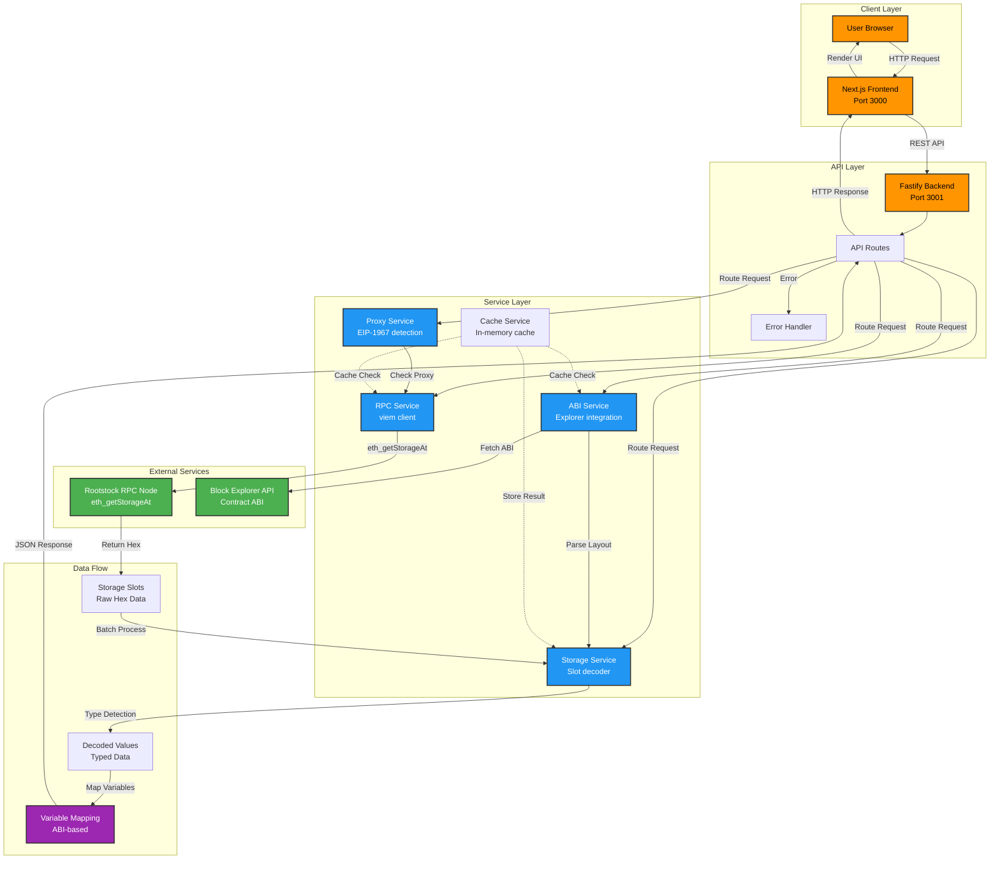
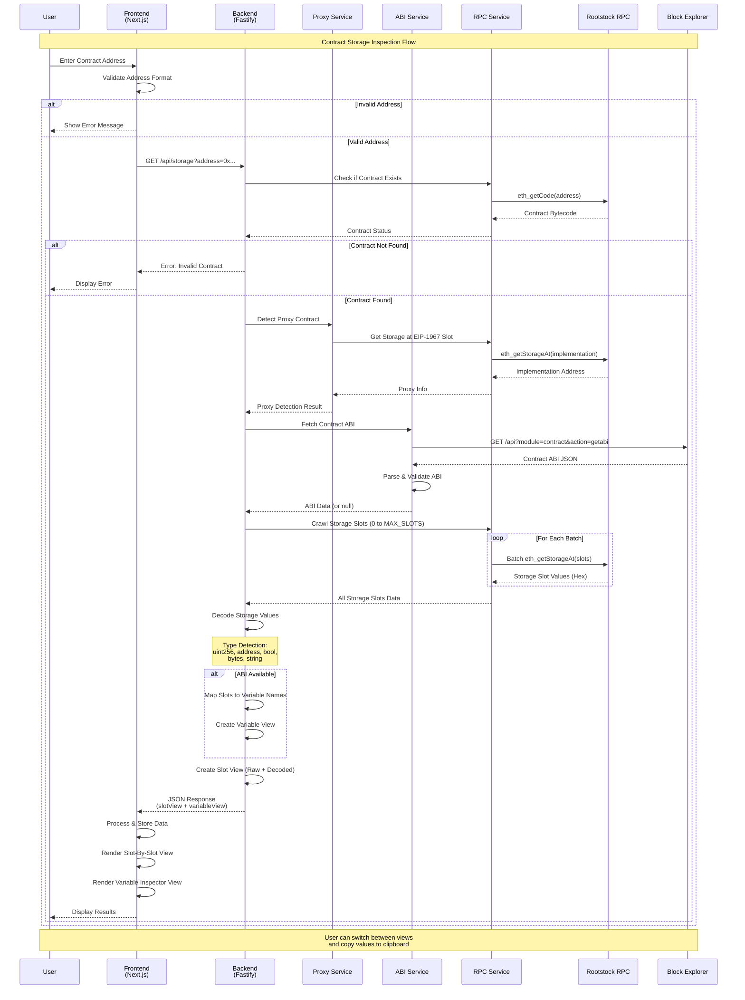

# Rootstock StateLens

<div align="center">

**A Visual Smart Contract Storage Explorer for Rootstock**

[](https://www.typescriptlang.org/)
[](https://nextjs.org/)
[](https://www.fastify.io/)
[](LICENSE)

*Explore and decode smart contract storage on Rootstock blockchain*

</div>

---

## 📖 About Rootstock

**Rootstock (RSK)** is a smart contract platform secured by the Bitcoin network through merge-mining. It's the first smart contract platform that enables smart contracts to be secured by the Bitcoin network's hashing power. Rootstock brings Ethereum-compatible smart contracts to Bitcoin, allowing developers to build decentralized applications with Bitcoin-level security.

**Key Features of Rootstock:**
- 🛡️ **Bitcoin Security**: Secured by merge-mining with Bitcoin
- 💰 **Native Currency**: RBTC (Rootstock Bitcoin) - 1:1 pegged with BTC
- ⚡ **EVM Compatible**: Supports Ethereum smart contracts and tooling
- 🌐 **Infrastructure**: RIF (Rootstock Infrastructure Framework) ecosystem
- 📈 **Scalability**: Enhanced performance with 30-second block times

## 🎯 What is StateLens?

**Rootstock StateLens** is a powerful visual explorer that allows you to inspect and understand the storage state of any smart contract deployed on the Rootstock blockchain. It automatically decodes raw storage slots into human-readable values, making contract debugging, auditing, and analysis easier.

### Why Use StateLens?

- 🔍 **Deep Inspection**: View every storage slot and decoded variable in a contract
- 📊 **Visual Interface**: Clean, intuitive UI with dark mode support
- 🎯 **Smart Decoding**: Automatically detects types (uint256, address, bool, string, etc.)
- 🔄 **Proxy Support**: Automatically detects and resolves EIP-1967 proxy contracts
- ⚡ **Fast & Efficient**: Batch processing and caching for optimal performance
- 🎨 **Modern Design**: Beautiful orange-themed UI matching Rootstock branding

## ✨ Features

### Core Capabilities

- **Storage Slot Analysis**: Read and analyze storage slots from 0 to configurable limit
- **Smart Type Detection**: Automatically decode uint256, address, bool, bytes, and strings
- **ABI Integration**: Fetch and use contract ABIs to map slots to variable names
- **Proxy Detection**: Auto-detect EIP-1967 proxy contracts and resolve implementation
- **Dual Views**: 
  - **Slot-By-Slot View**: Raw hex data with automatic type detection
  - **Variable Inspector**: Decoded variables with names (when ABI available)

### User Interface

- 🎨 **Modern UI**: Beautiful orange-themed design inspired by Rootstock
- 🌙 **Dark Mode**: Toggle between light and dark themes
- 📋 **Copy to Clipboard**: One-click copy for addresses and values
- 📊 **Interactive Tables**: Sort, filter, and paginate through storage slots
- 📱 **Responsive Design**: Works on desktop and mobile devices
- 🔔 **Toast Notifications**: User-friendly feedback for all actions

## 🔄 Workflow



## 🔀 System Flow



## 📊 Sequence Flow



## 🏗️ Architecture

```
┌─────────────────┐
│   Frontend      │
│   (Next.js)     │
│   Port: 3000    │
└────────┬────────┘
         │ HTTP/REST
         ▼
┌─────────────────┐
│   Backend       │
│   (Fastify)     │
│   Port: 3001    │
└────────┬────────┘
         │ RPC
         ▼
┌─────────────────┐
│ Rootstock RPC   │
│ (mainnet/testnet)│
└─────────────────┘
```

### Technology Stack

**Frontend:**
- Next.js 14 (App Router)
- TypeScript
- TailwindCSS
- TanStack Query (React Query)
- Ag-Grid React
- React Hot Toast

**Backend:**
- Fastify (High-performance HTTP server)
- TypeScript
- viem (Ethereum/Rootstock RPC client)
- Zod (Validation)
- node-cache (In-memory caching)

## 🚀 Quick Start

### Prerequisites

- **Node.js** 18 or higher
- **npm** or **yarn** package manager
- Access to a Rootstock RPC node (see [Configuration](#-configuration))

### Installation

1. **Clone the repository:**
```bash
git clone https://github.com/sainath5001/rootstock-storage-explorer.git
cd rootstock-storage-explorer
```

2. **Install backend dependencies:**
```bash
cd backend
npm install
```

3. **Install frontend dependencies:**
```bash
cd ../frontend
npm install
```

### Configuration

#### Backend Configuration

1. Navigate to backend directory:
```bash
cd backend
```

2. Create `.env` file:
```bash
cp env.example.txt .env
```

3. Edit `.env` with your settings:
```env
# Rootstock RPC Configuration
RPC_URL=https://mainnet.sovryn.app/rpc

# Server Configuration
PORT=3001
NODE_ENV=development

# CORS Configuration
CORS_ORIGIN=http://localhost:3000

# Storage Crawler Configuration
MAX_STORAGE_SLOTS=500
BATCH_SIZE=50

# Cache Configuration
CACHE_TTL=300

# Block Explorer API (optional)
ROOTSTOCK_EXPLORER_API=https://blockscout.com/rsk/mainnet/api
```

#### Frontend Configuration

1. Navigate to frontend directory:
```bash
cd frontend
```

2. Create `.env.local` file:
```bash
cp env.example.txt .env.local
```

3. Edit `.env.local`:
```env
NEXT_PUBLIC_API_URL=http://localhost:3001
```

### Running the Application

#### Development Mode

**Terminal 1 - Start Backend:**
```bash
cd backend
npm run dev
```

The backend will start on `http://localhost:3001`

**Terminal 2 - Start Frontend:**
```bash
cd frontend
npm run dev
```

The frontend will start on `http://localhost:3000`

Open your browser and navigate to `http://localhost:3000`

#### Production Mode

**Build and start backend:**
```bash
cd backend
npm run build
npm start
```

**Build and start frontend:**
```bash
cd frontend
npm run build
npm start
```

## 📚 Usage Guide

### Basic Usage

1. **Open the application** in your browser (`http://localhost:3000`)

2. **Click "Inspect Contract"** button to open the inspection modal

3. **Paste a Rootstock contract address** (e.g., `0x2acc95758f8b5f583470ba265eb685a8f45fc9d5`)

4. **Click "Inspect Now"** to analyze the contract storage

5. **View Results:**
   - **Slot-By-Slot View**: See all storage slots with raw hex values and decoded types
   - **Variable Inspector**: View decoded variables with names (when ABI is available)

### Example Contract Addresses

Here are some verified contracts you can test with:

| Contract | Address | Description |
|----------|---------|-------------|
| **RIF Token** | `0x2acc95758f8b5f583470ba265eb685a8f45fc9d5` | Rootstock Infrastructure Framework Token |
| **DOC Token** | `0xe700691da7b9851f2f35f8b8182c69c53ccad9db` | Dollar on Chain Token |
| **BPRO Token** | `0x440cd83c160de5c96ddb20246815ea44c7abbca8` | BPRO Token |

### Advanced Features

#### Custom ABI Support

You can provide a contract ABI via the API to get better variable name mapping:

```bash
curl -X POST http://localhost:3001/api/storage \
  -H "Content-Type: application/json" \
  -d '{
    "address": "0x...",
    "abi": [...],
    "storageLayout": {...}
  }'
```

#### Specific Slot Queries

Query specific storage slots:

```bash
curl -X POST http://localhost:3001/api/storage/slots \
  -H "Content-Type: application/json" \
  -d '{
    "address": "0x...",
    "slots": [0, 1, 2, 3]
  }'
```

## 📁 Project Structure

```
rootstock-storage-explorer/
├── backend/                 # Backend API server
│   ├── src/
│   │   ├── api/            # API routes
│   │   ├── services/       # Business logic services
│   │   ├── utils/          # Utility functions
│   │   └── config/         # Configuration
│   ├── package.json
│   └── README.md
│
├── frontend/               # Frontend web application
│   ├── app/                # Next.js app directory
│   ├── components/         # React components
│   ├── hooks/              # Custom React hooks
│   ├── services/           # API services
│   ├── types/              # TypeScript types
│   ├── lib/                # Utility functions
│   ├── package.json
│   └── README.md
│
└── README.md              # This file
```

## ⚙️ Configuration

### Environment Variables

#### Backend (`.env`)

| Variable | Description | Default | Required |
|----------|-------------|---------|----------|
| `RPC_URL` | Rootstock RPC endpoint | - | ✅ Yes |
| `PORT` | Server port | `3001` | No |
| `CORS_ORIGIN` | Allowed CORS origins | `http://localhost:3000` | No |
| `MAX_STORAGE_SLOTS` | Maximum slots to crawl | `500` | No |
| `BATCH_SIZE` | RPC batch size | `50` | No |
| `CACHE_TTL` | Cache TTL in seconds | `300` | No |

#### Frontend (`.env.local`)

| Variable | Description | Default |
|----------|-------------|---------|
| `NEXT_PUBLIC_API_URL` | Backend API URL | `http://localhost:3001` |

### Rootstock RPC Endpoints

**Mainnet:**
- `https://mainnet.sovryn.app/rpc` (Recommended)
- `https://public-node.rsk.co`

**Testnet:**
- `https://testnet.sovryn.app/rpc`
- `https://public-node.testnet.rsk.co`

## 🔧 API Reference

### GET `/api/storage?address=<contractAddress>`

Analyzes contract storage and returns both slot view and variable view.

**Example:**
```bash
curl "http://localhost:3001/api/storage?address=0x2acc95758f8b5f583470ba265eb685a8f45fc9d5"
```

**Response:**
```json
{
  "address": "0x2acc95758f8b5f583470ba265eb685a8f45fc9d5",
  "isProxy": false,
  "slotView": [
    {
      "slot": 0,
      "raw": "0x5249460000000000000000000000000000000000000000000000000000000006",
      "decodedType": "address",
      "decodedValue": "0x0000000000000000000000000000000000000006"
    }
  ],
  "variableView": [
    {
      "name": "totalSupply",
      "type": "uint256",
      "value": "1541801800",
      "slot": 12
    }
  ],
  "abiSource": "explorer"
}
```

### GET `/api/health`

Health check endpoint to verify backend and RPC connection.

**Example:**
```bash
curl http://localhost:3001/api/health
```

For more API documentation, see [backend/README.md](./backend/README.md)

## 🐛 Troubleshooting

### Backend Issues

**RPC Connection Failed**
- Verify your `RPC_URL` is correct and accessible
- Test the RPC endpoint: `curl -X POST <RPC_URL> -H "Content-Type: application/json" -d '{"jsonrpc":"2.0","method":"eth_blockNumber","params":[],"id":1}'`
- Ensure you're using a working endpoint (try `https://mainnet.sovryn.app/rpc`)

**Port Already in Use**
```bash
# Kill process on port 3001
lsof -ti:3001 | xargs kill -9
```

**Slow Performance**
- Reduce `MAX_STORAGE_SLOTS` if you only need a few slots
- Increase `BATCH_SIZE` (but be mindful of RPC limits)
- Use an archive node for better performance

### Frontend Issues

**Backend Connection Error**
- Ensure backend is running on port 3001
- Check `NEXT_PUBLIC_API_URL` in `.env.local`
- Verify CORS is configured in backend

**Build Errors**
```bash
# Clear Next.js cache
cd frontend
rm -rf .next
npm run build
```

**Browser Console Errors**
- Hard refresh: `Ctrl+Shift+R` (Windows/Linux) or `Cmd+Shift+R` (Mac)
- Clear browser cache
- Check browser console for detailed error messages

### Common Issues

**"Invalid contract address" Error**
- Ensure address is 42 characters (0x + 40 hex characters)
- Check browser console for validation debug logs
- Verify address is a valid Rootstock contract (has code)

**No Variable Names Showing**
- Contract must be verified on Rootstock explorer
- Or provide ABI via POST endpoint
- Variable names require contract ABI

## 🧪 Testing

### Test Contract Addresses

**Valid Contracts (Working):**
- RIF Token: `0x2acc95758f8b5f583470ba265eb685a8f45fc9d5`
- DOC Token: `0xe700691da7b9851f2f35f8b8182c69c53ccad9db`
- BPRO Token: `0x440cd83c160de5c96ddb20246815ea44c7abbca8`

**Invalid Addresses (For Testing Error Handling):**
- Too short: `0x12345`
- Invalid format: `0xGHIJKL...`
- Null address: `0x0000000000000000000000000000000000000000`

## 🤝 Contributing

Contributions are welcome! Please follow these steps:

1. Fork the repository
2. Create a feature branch (`git checkout -b feature/amazing-feature`)
3. Commit your changes (`git commit -m 'Add amazing feature'`)
4. Push to the branch (`git push origin feature/amazing-feature`)
5. Open a Pull Request

### Development Guidelines

- Follow existing code style
- Write TypeScript with proper types
- Add comments for complex logic
- Test your changes thoroughly
- Update documentation as needed

## 📝 License

This project is licensed under the MIT License - see the [LICENSE](LICENSE) file for details.

## 🔗 Useful Links

- **Rootstock Official**: https://rootstock.io/
- **Rootstock Docs**: https://dev.rootstock.io/
- **Rootstock Explorer**: https://explorer.rsk.co/
- **RIF Token**: https://www.rifos.org/

## 🙏 Acknowledgments

- Built for the Rootstock blockchain community
- Inspired by the need for better contract debugging tools
- Uses open-source libraries from the Ethereum ecosystem

## 📧 Support

For issues, questions, or contributions:
- Open an issue on GitHub
- Check existing documentation in `backend/README.md` and `frontend/README.md`
- Review troubleshooting section above

---

<div align="center">

**Made with ❤️ for the Rootstock Community**

[⬆ Back to Top](#-rootstock-statelens)

</div>

